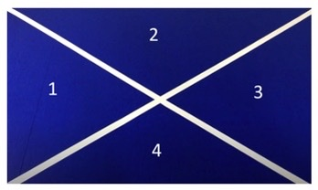

## Tennis Ball Detection
### Summary
This projects aims to detect and track a tennis ball as it rolls through the scene. 

#### Detecting the Tennis Ball
The algorithm uses the HSV color space to separate the tennis ball from the background and then uses findContours() function in OpenCV to detect the tennis ball.

#### Tracking the Tennis Ball
To determine which region the ball is currently in, we must first find the equation of our boundary lines. Using a probabilistic hough transform algorithm from OpenCV, we can detect the lines in our image. Since both lines span the corners of the scene, we can rely on the min and max x and y values of the detected lines to approximate our equations. Once we have our equations, we can utilize the (x,y) coordinate of the tennis ball along with the two equations to determine the current location of the ball. 

### Dependencies
This project uses python3 along with the following libraries.
+ OpenCV
+ argparse
+ numpy
+ math

### To Run
To install the dependencies and run this project, clone this repository and run the "install_and_run" script. 
